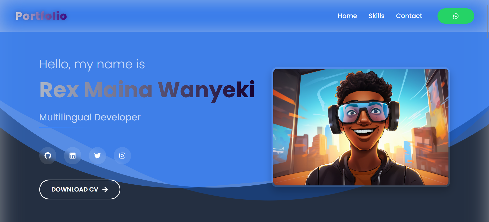

# 🚀 Rex Maina Wanyeki - Portfolio Website

Welcome to my personal portfolio — a modern, fully responsive React-based web application showcasing my technical skills, projects, and passion as a **multilingual developer** and **computer scientist**.



## 🔥 Features

- ✨ Animated Hero Section
- 📱 Fully Responsive Design
- 🌐 React + Vite
- 🎨 Custom CSS Styling
- 💬 Contact Form powered by [FormSubmit](https://formsubmit.co/)
- 🧠 Organized Skill Sections (Programming, Web, Mobile, Data, Tools, Academic)
- 💼 CV Download & Social Links

---

## 📸 Preview

Live Demo → [rexmaina.netlify.app](https://phenomenal-treacle-dfff2e.netlify.app/) 

---

## 🛠️ Tech Stack

| Tech           | Usage                          |
|----------------|--------------------------------|
| React          | Frontend framework             |
| Vite           | Blazing fast dev server        |
| Custom CSS     | Styling & responsiveness       |
| FormSubmit     | Contact form backend           |
| React Icons    | Beautiful developer icons      |

---

## 💡 Contributing

Want to suggest a change, add a feature or fix a bug?  
Feel free to fork, clone and make a pull request 🙌

```bash
git clone https://github.com/RexMaina/portfolio.git
```
## 🧑‍💻 Author

<div align="center">
  <a href="mailto:rexwanyeki@gmail.com">📧 Email</a> | 
  <a href="https://linkedin.com/in/rex-maina-7b7474158">🌐 LinkedIn</a> | 
  <a href="tel:+254792615071">📞 +254 792 615 071</a>
</div>

<div align="center">
  <sub>Built with ♥ by Rex Maina Wanyeki</sub>
</div>
